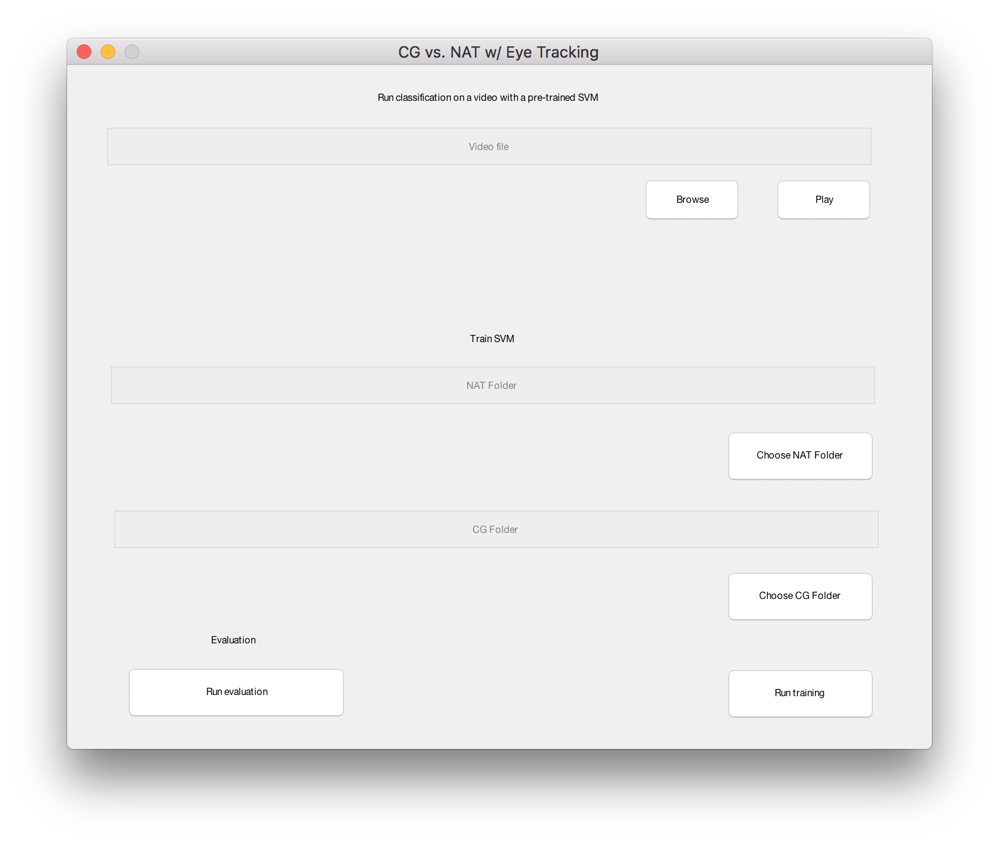

# CG vs NAT w/ Eye Tracking

> Main menu, shown once 'run_main.m' is run

## Classification of an existing video

Use the top part of the main menu.
- Browse button: Choose the video to classify
- Play: Start video analysis

Once the analysis has been started, wait for it to complete (could take up to three times the length of the video, depending on the CPU of the computer).
At the end of the analysis Matlab will prompt for the .mat file containing the trained SVM model. The best model is already inside the '3.Results/trained_models' folder.

## Run feature collection and SVM training

- Choose NAT Folder button: choose the folder containing natural videos to use for training
- Choose CG Folder button: choose the folder containing Computer Generated videos to use for training
- Run training button: Start analyzing all videos and train the SVM at the end of the process

Once the process is complete, Matlab will prompt to save the .mat file containing all the samples obtained from the videos.
After this, training will start and Matlab will prompt to save the trained SVM as a .mat file.

## Run evaluation of a trained SVM

Matlab will prompt for a .mat file containing the samples. The .mat file used for the trained model is inside the '3.Results/sample_files' folder.
Once chosen, kfold cross validation with 20 folds will be run.
